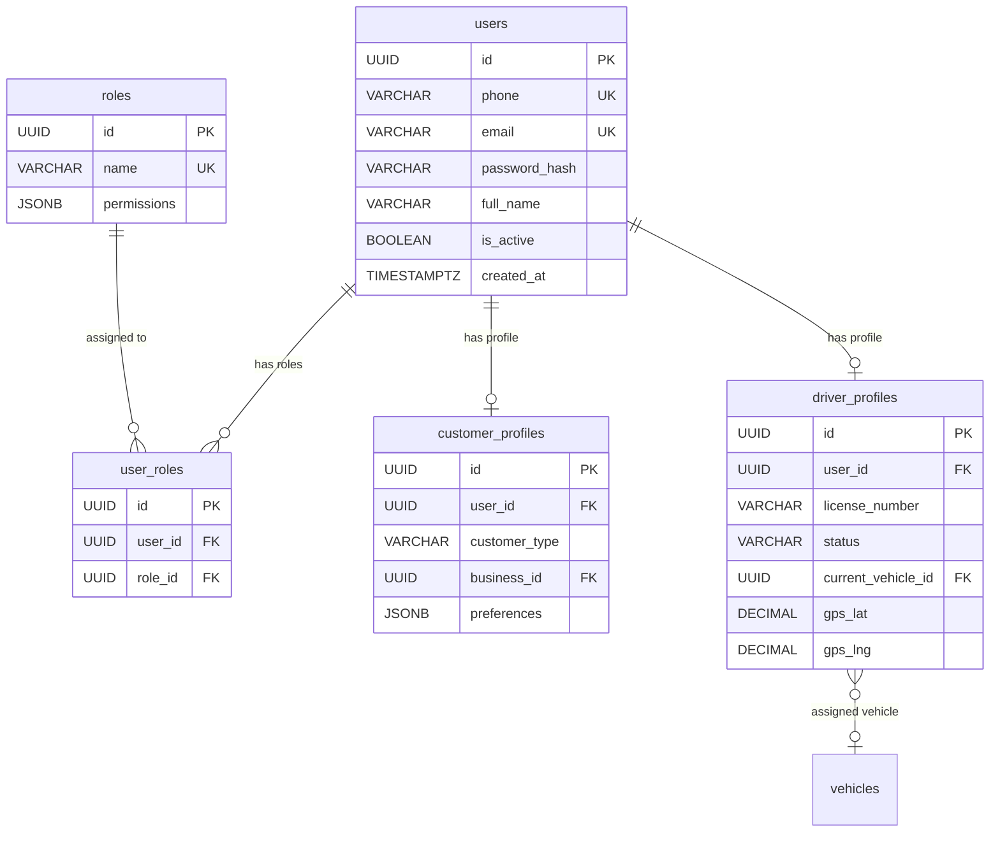
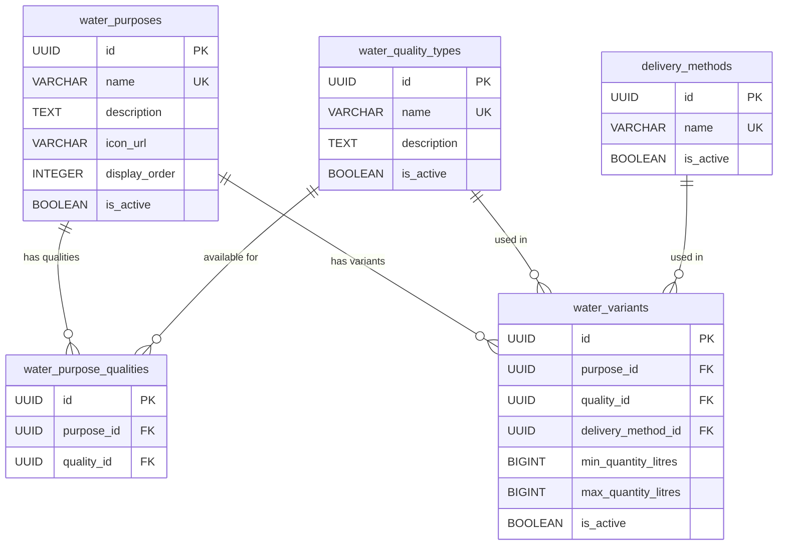
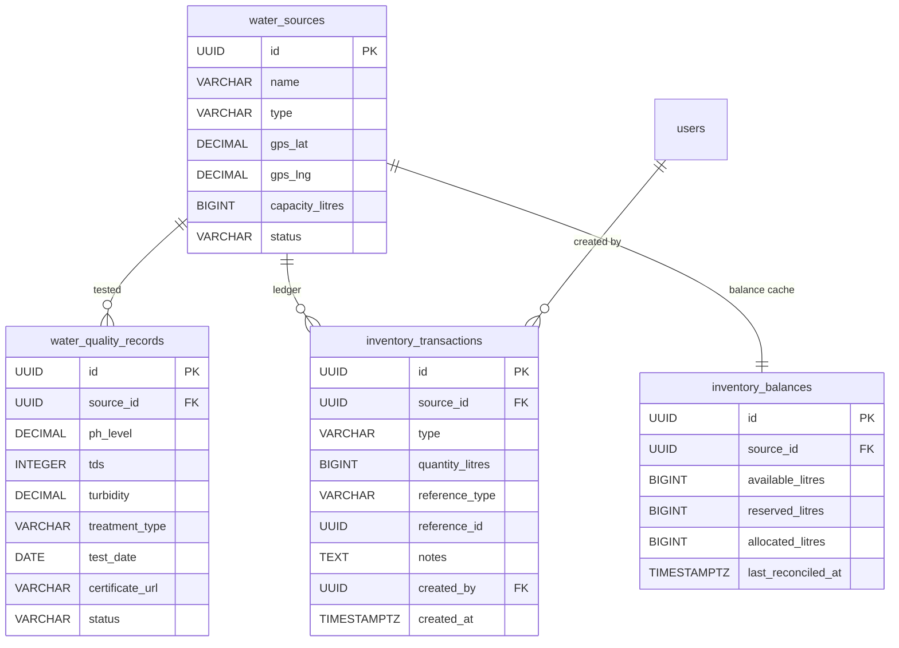
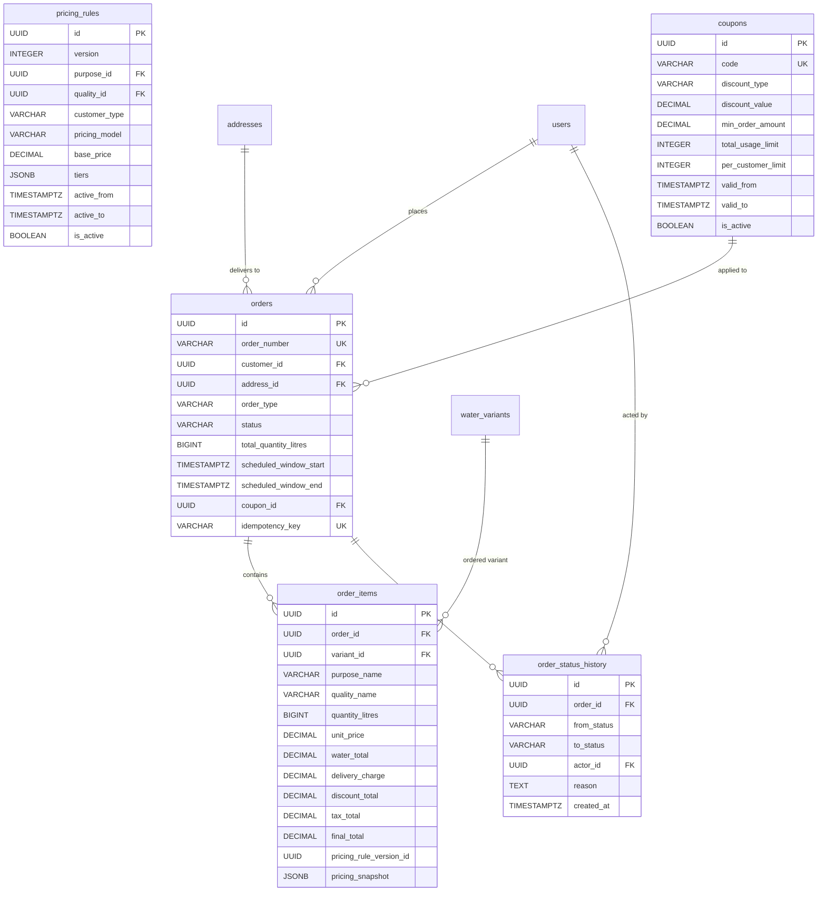
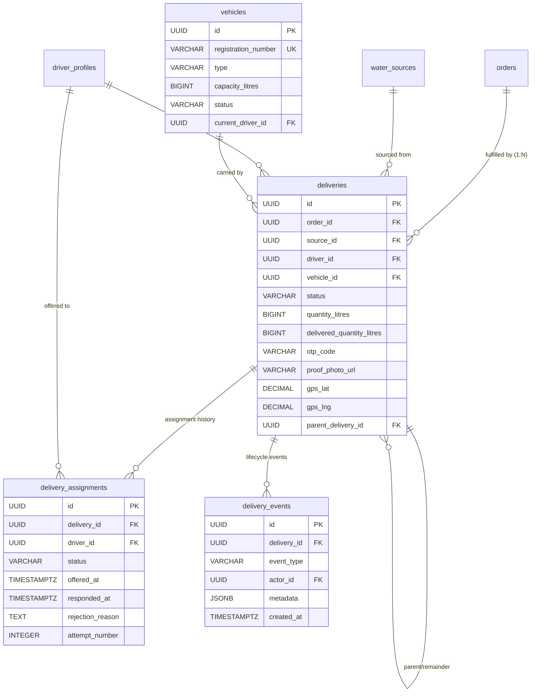
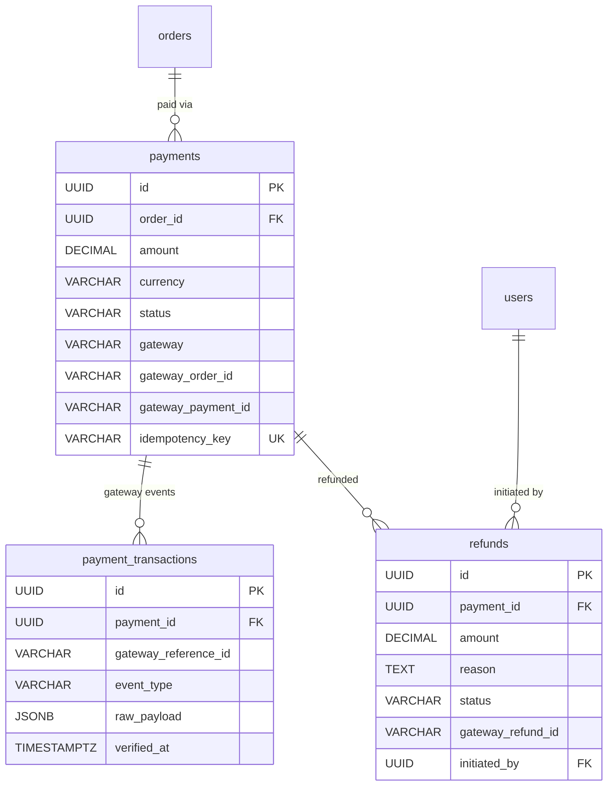
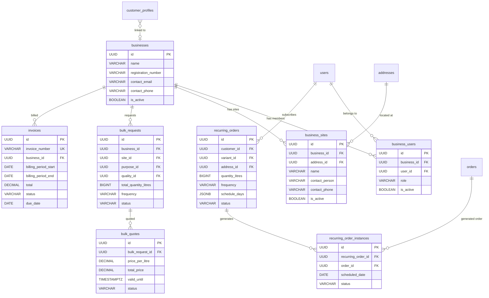
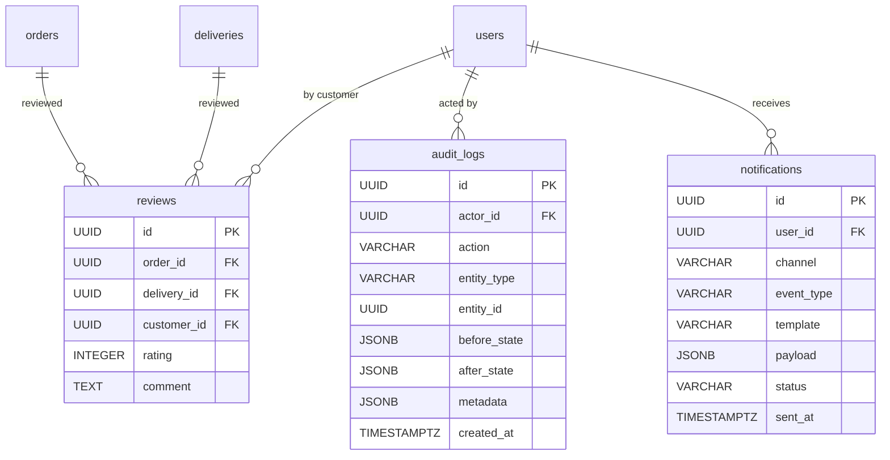
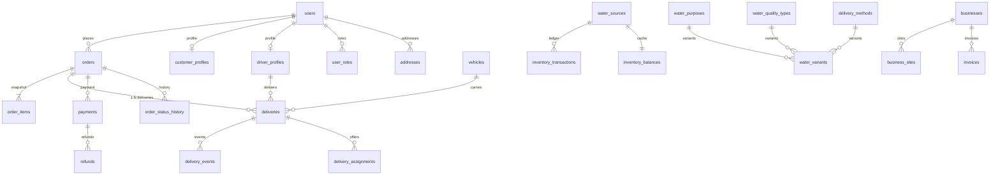

# AquaSwift — Entity-Relationship Diagrams

**Version:** 1.0
**Status:** Draft
**Last Updated:** 2026-09-03

---

> All diagrams use Mermaid ER syntax. Diagrams are grouped by domain for readability. See `DATABASE_ARCHITECTURE.md` for full column definitions.

---

## 1. Identity & Access Domain

---

## 2. Catalog Domain

---

## 3. Inventory Domain

---

## 4. Commerce Domain

---

## 5. Fulfilment Domain

---

## 6. Payment Domain

---

## 7. B2B Extensions Domain

---

## 8. Platform Domain

---

## 9. Full System Overview (Simplified)

