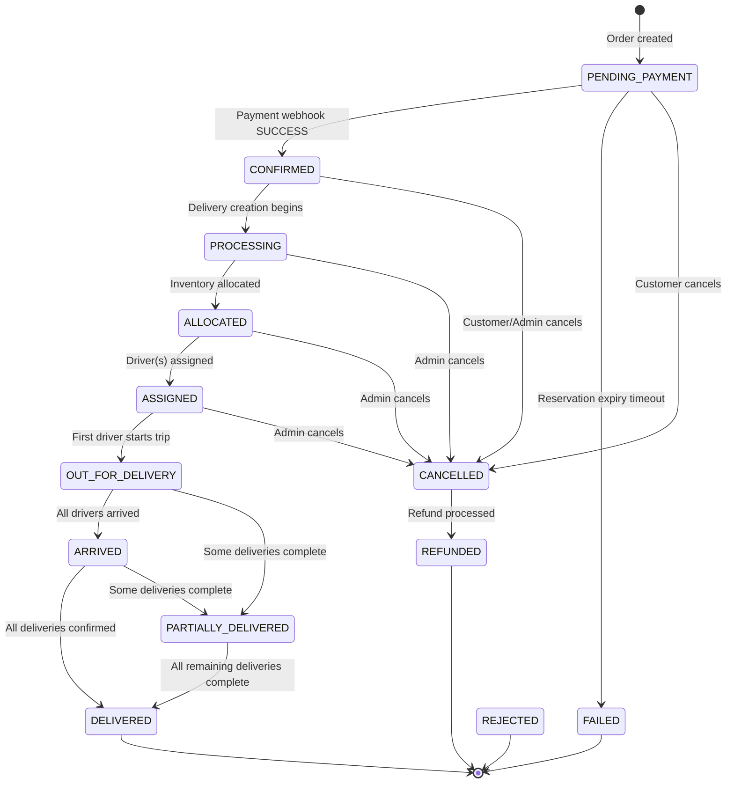
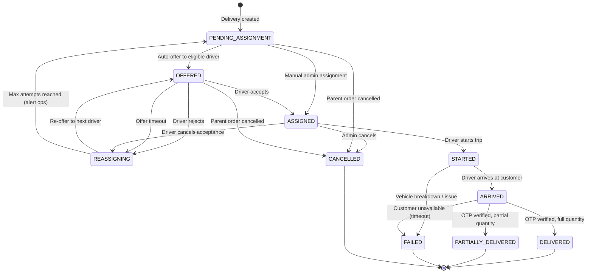
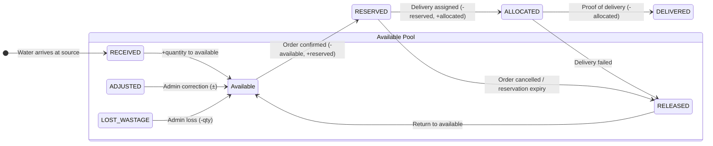

# AquaSwift — State Machines

**Version:** 1.0
**Status:** Draft
**Last Updated:** 2026-09-03

---

> Complete state machine definitions for Orders, Deliveries, and Inventory transactions. Each state machine is implemented as an explicit `transition(entity, new_status, actor, reason)` function per DEC-STATE-001.

---

## 1. Order State Machine

### 1.1 States

| State | Description |
|-------|-------------|
| `PENDING_PAYMENT` | Order created, inventory reserved, awaiting payment confirmation via webhook. |
| `CONFIRMED` | Payment verified via webhook; order is ready for processing. |
| `PROCESSING` | Order is being prepared — deliveries are being created and assigned. |
| `ALLOCATED` | Inventory has been allocated to specific source(s)/vehicle(s) for all deliveries. |
| `ASSIGNED` | All deliveries have been assigned to drivers. |
| `OUT_FOR_DELIVERY` | At least one delivery is en route (driver has started trip). |
| `ARRIVED` | All deliveries have arrived at the customer location. |
| `PARTIALLY_DELIVERED` | At least one delivery completed, but not all (partial delivery scenario). |
| `DELIVERED` | All child deliveries have reached DELIVERED status. Terminal state. |
| `CANCELLED` | Order cancelled by customer (pre-OUT_FOR_DELIVERY) or admin (any status). Terminal state. |
| `FAILED` | Order failed due to payment timeout (reservation expiry) or system error. Terminal state. |
| `REFUNDED` | Order has been refunded after cancellation. Terminal state. |
| `REJECTED` | Order rejected by system (e.g., inventory insufficient after re-check). Terminal state. |

### 1.2 State Diagram



### 1.3 Allowed Transitions

| From | To | Trigger | Side Effects |
|------|----|---------|--------------|
| `PENDING_PAYMENT` | `CONFIRMED` | Payment webhook SUCCESS | Notify customer (order confirmed); begin delivery creation |
| `PENDING_PAYMENT` | `FAILED` | Reservation expiry (Celery beat) | Release reserved inventory (RELEASED txn); notify customer |
| `PENDING_PAYMENT` | `CANCELLED` | Customer cancels | Release reserved inventory; initiate refund (if payment pending) |
| `CONFIRMED` | `PROCESSING` | System creates delivery records | Create delivery record(s) in PENDING_ASSIGNMENT |
| `CONFIRMED` | `CANCELLED` | Customer/Admin cancels | Release reserved inventory; initiate refund; notify customer |
| `PROCESSING` | `ALLOCATED` | All deliveries have inventory allocated | Create ALLOCATED inventory txns |
| `PROCESSING` | `CANCELLED` | Admin cancels | Release inventory; initiate refund; cancel pending deliveries |
| `ALLOCATED` | `ASSIGNED` | All deliveries assigned to drivers | Notify drivers; notify customer |
| `ALLOCATED` | `CANCELLED` | Admin cancels | Release allocated inventory; initiate refund; cancel deliveries |
| `ASSIGNED` | `OUT_FOR_DELIVERY` | First driver starts trip | Notify customer (driver en route) |
| `ASSIGNED` | `CANCELLED` | Admin cancels (with reason) | Release inventory; initiate refund; unassign drivers |
| `OUT_FOR_DELIVERY` | `ARRIVED` | All drivers arrived at customer | Notify customer (driver arrived) |
| `OUT_FOR_DELIVERY` | `PARTIALLY_DELIVERED` | At least one delivery completed, not all | Update delivered quantities |
| `ARRIVED` | `DELIVERED` | All deliveries OTP-verified and completed | Create DELIVERED inventory txns; notify customer; update driver earnings |
| `ARRIVED` | `PARTIALLY_DELIVERED` | Some deliveries completed | Create remainder deliveries for incomplete ones |
| `PARTIALLY_DELIVERED` | `DELIVERED` | All remaining deliveries completed | Final DELIVERED txns; notify customer |
| `CANCELLED` | `REFUNDED` | Gateway confirms refund | Update payment status; notify customer |

### 1.4 Transition Function Signature

```python
async def transition_order(
    db: AsyncSession,
    order: Order,
    new_status: OrderStatus,
    actor: User,
    reason: str | None = None,
) -> Order:
    """
    Validate and execute an order status transition.
    
    1. Check (order.status, new_status) is in ALLOWED_TRANSITIONS
    2. Apply order.status = new_status inside the current DB transaction
    3. Write OrderStatusHistory row (from_status, to_status, actor_id, reason)
    4. Execute side effects (inventory, payments, notifications)
    5. Return updated order
    
    Raises IllegalTransitionError if transition is not allowed.
    """
```

---

## 2. Delivery State Machine

### 2.1 States

| State | Description |
|-------|-------------|
| `PENDING_ASSIGNMENT` | Delivery created, waiting for driver assignment (auto-offer or manual). |
| `OFFERED` | Delivery has been offered to a specific driver; timeout timer started. |
| `ASSIGNED` | Driver has accepted the delivery offer. |
| `STARTED` | Driver has started the trip (en route to source or customer). |
| `ARRIVED` | Driver has arrived at the customer location. |
| `DELIVERED` | Delivery completed — OTP verified, quantity confirmed. Terminal state. |
| `PARTIALLY_DELIVERED` | Driver delivered less than full quantity; remainder delivery auto-created. Terminal state for this delivery. |
| `FAILED` | Delivery failed (customer unavailable, vehicle breakdown, etc.). Terminal state for this delivery. |
| `REASSIGNING` | Transient state: previous offer was rejected/timed out; re-offering to next driver. |
| `CANCELLED` | Delivery cancelled (parent order cancelled or admin action). Terminal state. |

### 2.2 State Diagram



### 2.3 Allowed Transitions

| From | To | Trigger | Side Effects |
|------|----|---------|--------------|
| `PENDING_ASSIGNMENT` | `OFFERED` | Auto-offer to eligible driver | Send push notification to driver; start offer timeout timer |
| `PENDING_ASSIGNMENT` | `ASSIGNED` | Admin manual assignment | Record assignment in delivery_assignments; notify driver |
| `PENDING_ASSIGNMENT` | `CANCELLED` | Parent order cancelled | Release any allocated inventory |
| `OFFERED` | `ASSIGNED` | Driver accepts (`POST /deliveries/{id}/respond` accept) | Record acceptance in delivery_assignments; allocate inventory; notify customer |
| `OFFERED` | `REASSIGNING` | Driver rejects (`POST /deliveries/{id}/respond` reject) | Record rejection with reason in delivery_assignments |
| `OFFERED` | `REASSIGNING` | Offer timeout (no response) | Record timeout in delivery_assignments |
| `OFFERED` | `CANCELLED` | Parent order cancelled | Release inventory; cancel offer timer |
| `REASSIGNING` | `OFFERED` | Next eligible driver found | Increment attempt counter; send push to new driver |
| `REASSIGNING` | `PENDING_ASSIGNMENT` | Max offer attempts exhausted | Generate ops alert; delivery available for manual assignment |
| `ASSIGNED` | `STARTED` | Driver starts trip (`POST /deliveries/{id}/start`) | Write delivery_event; notify customer (driver en route); update parent order status |
| `ASSIGNED` | `REASSIGNING` | Driver cancels acceptance | Record in delivery_assignments; return to offer pool |
| `ASSIGNED` | `CANCELLED` | Admin cancels | Release allocated inventory; notify driver |
| `STARTED` | `ARRIVED` | Driver arrives (`POST /deliveries/{id}/arrive`) | Write delivery_event; notify customer (driver arrived) |
| `STARTED` | `FAILED` | Vehicle breakdown or issue | Write delivery_event; create replacement delivery; release allocated inventory; notify customer + ops |
| `ARRIVED` | `DELIVERED` | OTP verified, full quantity (`POST /deliveries/{id}/complete`) | Write DELIVERED inventory txn; record GPS/photo proof; write delivery_event; check if all deliveries done → parent order DELIVERED; notify customer |
| `ARRIVED` | `PARTIALLY_DELIVERED` | OTP verified, partial quantity | Write DELIVERED inventory txn for actual qty; create new delivery for remainder (PENDING_ASSIGNMENT); write delivery_event; notify customer (partial + remainder info) |
| `ARRIVED` | `FAILED` | Customer unavailable after waiting | Write delivery_event; release allocated inventory; ops alert; notify customer |

### 2.4 Offer/Accept/Reject/Timeout Loop

```
1. Delivery enters PENDING_ASSIGNMENT
2. System selects eligible driver (AVAILABLE status, vehicle capacity ≥ delivery quantity)
3. Delivery → OFFERED to selected driver
4. Push notification sent to driver
5. Timeout timer started (configurable, e.g., 120 seconds)
6. IF driver accepts → ASSIGNED → continue normal flow
   IF driver rejects → REASSIGNING → record reason → go to step 2 with next driver
   IF timeout → REASSIGNING → record timeout → go to step 2 with next driver
7. After N failed attempts (configurable) → PENDING_ASSIGNMENT + ops alert for manual assignment
```

### 2.5 Transition Function Signature

```python
async def transition_delivery(
    db: AsyncSession,
    delivery: Delivery,
    new_status: DeliveryStatus,
    actor: User,
    reason: str | None = None,
    delivered_quantity_litres: int | None = None,
    otp_code: str | None = None,
    gps_lat: float | None = None,
    gps_lng: float | None = None,
    proof_photo_url: str | None = None,
) -> Delivery:
    """
    Validate and execute a delivery status transition.
    
    1. Check (delivery.status, new_status) is in ALLOWED_TRANSITIONS
    2. Perform status-specific validation (e.g., OTP for DELIVERED, quantity for PARTIALLY_DELIVERED)
    3. Apply delivery.status = new_status
    4. Write DeliveryEvent row
    5. Execute side effects (inventory txns, parent order status check, notifications)
    6. Return updated delivery
    """
```

---

## 3. Inventory Transaction Lifecycle

### 3.1 Transaction Types

| Type | Direction | Trigger | Description |
|------|-----------|---------|-------------|
| `RECEIVED` | + (increase available) | Admin records incoming water | Water arrives at a source from supplier |
| `RESERVED` | − available, + reserved | Order confirmed | Soft hold on inventory for an order |
| `RELEASED` | + available, − reserved/allocated | Order cancelled / delivery failed / reservation expiry | Return held inventory to available pool |
| `ALLOCATED` | − reserved, + allocated | Delivery assigned to driver/vehicle | Commit reserved inventory to a specific delivery |
| `DELIVERED` | − allocated | Delivery completed with OTP | Final deduction for delivered water |
| `ADJUSTED` | ± available | Admin manual adjustment | Correction with mandatory reason |
| `LOST_WASTAGE` | − available | Admin records loss | Documented loss (leak, contamination, etc.) |

### 3.2 Lifecycle Flow



### 3.3 Conservation Law

At any point in time, for each water source:

```
available + reserved + allocated + delivered + lost_wastage = total_received
```

Where each term is computed by summing the relevant transaction types from the ledger:
- `total_received = SUM(quantity WHERE type = RECEIVED) + SUM(quantity WHERE type = ADJUSTED AND quantity > 0)`
- `available = total_received - reserved - allocated - delivered - lost_wastage + SUM(quantity WHERE type = ADJUSTED AND quantity < 0)`
- `reserved = SUM(quantity WHERE type = RESERVED) - SUM(quantity WHERE type = RELEASED AND was_reserved) - SUM(quantity WHERE type = ALLOCATED)`
- `allocated = SUM(quantity WHERE type = ALLOCATED) - SUM(quantity WHERE type = RELEASED AND was_allocated) - SUM(quantity WHERE type = DELIVERED)`
- `delivered = SUM(quantity WHERE type = DELIVERED)`
- `lost_wastage = SUM(ABS(quantity) WHERE type = LOST_WASTAGE)`

### 3.4 Transaction Validation Rules

| Transaction Type | Validation | Error Code |
|-----------------|-----------|------------|
| `RECEIVED` | quantity > 0; source is ACTIVE | `SOURCE_INACTIVE` |
| `RESERVED` | quantity ≤ available; source is ACTIVE | `INVENTORY_INSUFFICIENT` |
| `RELEASED` | quantity ≤ (reserved or allocated for this reference) | `RELEASE_EXCEEDS_HOLD` |
| `ALLOCATED` | quantity ≤ reserved for this order | `ALLOCATION_EXCEEDS_RESERVATION` |
| `DELIVERED` | quantity ≤ allocated for this delivery | `DELIVERY_EXCEEDS_ALLOCATION` |
| `ADJUSTED` | mandatory reason provided; actor has `inventory:adjust` permission | `MISSING_ADJUSTMENT_REASON` |
| `LOST_WASTAGE` | mandatory reason provided; quantity < 0 | `MISSING_LOSS_REASON` |

### 3.5 Concurrency Control

```python
# During reservation, use row-level locking on inventory_balances
# to prevent race conditions (overselling)

async def reserve_inventory(
    db: AsyncSession,
    source_id: UUID,
    quantity_litres: int,
    order_id: UUID,
    actor: User,
) -> InventoryTransaction:
    # 1. Lock the balance row for this source
    balance = await db.execute(
        select(InventoryBalance)
        .where(InventoryBalance.source_id == source_id)
        .with_for_update()  # SELECT ... FOR UPDATE
    )
    
    # 2. Check available >= requested
    if balance.available_litres < quantity_litres:
        raise InventoryInsufficientError(...)
    
    # 3. Create RESERVED transaction (append-only)
    txn = InventoryTransaction(
        source_id=source_id,
        type=TransactionType.RESERVED,
        quantity_litres=-quantity_litres,  # negative = deduction from available
        reference_type="order",
        reference_id=order_id,
        created_by=actor.id,
    )
    db.add(txn)
    
    # 4. Update balance cache
    balance.available_litres -= quantity_litres
    balance.reserved_litres += quantity_litres
    
    return txn
```

### 3.6 Reservation Expiry Job

```python
# Celery beat task — runs every 60 seconds
@celery_app.task
def check_reservation_expiry():
    """
    Find orders in PENDING_PAYMENT past the configurable timeout.
    For each:
      1. Create RELEASED inventory transaction
      2. Transition order to FAILED
      3. Notify customer ("Your order has expired")
    """
    timeout = settings.RESERVATION_EXPIRY_MINUTES  # e.g., 15 minutes
    cutoff = utcnow() - timedelta(minutes=timeout)
    
    expired_orders = Order.query.filter(
        Order.status == OrderStatus.PENDING_PAYMENT,
        Order.created_at < cutoff,
    ).all()
    
    for order in expired_orders:
        release_inventory(order)
        transition_order(order, OrderStatus.FAILED, system_actor, "Reservation expiry")
        send_notification(order.customer, "order_expired", {"order_id": order.id})
```
